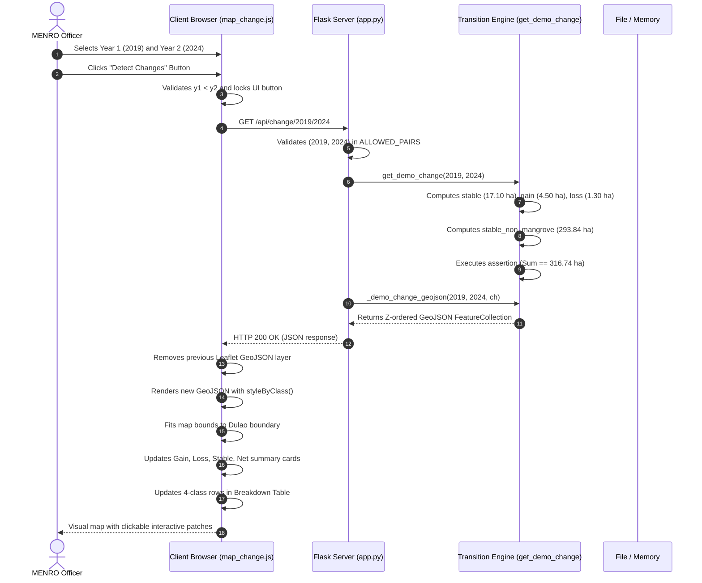
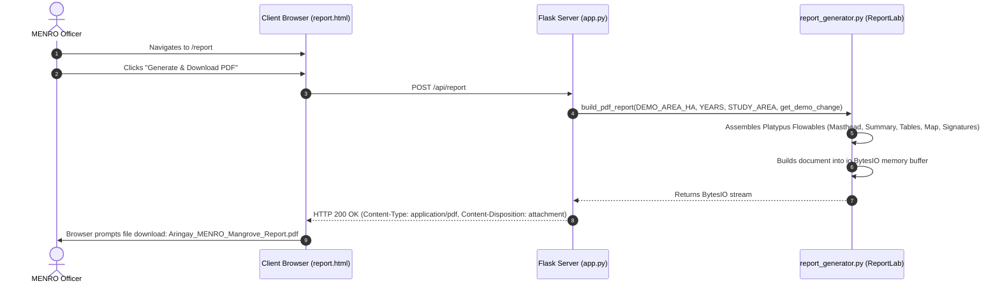

# System Architecture and Technical Operation Manual

**Deep Learning-Based Detection of Mangrove Gain and Loss in Barangay Dulao, Aringay, La Union**  
*Document Version: 1.0 — Comprehensive Technical Baseline & Thesis Reference*  
*Target Audience: Thesis Panelists, Academic Advisers, Municipal Environment Officers (MENRO), and Successor Developers*

---

## Table of Contents
1. [System Overview](#1-system-overview)
2. [Purpose and Scope](#2-purpose-and-scope)
3. [Current System Status](#3-current-system-status)
4. [Technology Stack](#4-technology-stack)
5. [Project Structure and File Layout](#5-project-structure-and-file-layout)
6. [System Architecture](#6-system-architecture)
7. [Application Startup and Runtime Environment](#7-application-startup-and-runtime-environment)
8. [Frontend Architecture](#8-frontend-architecture)
9. [Backend Architecture](#9-backend-architecture)
10. [REST API Reference](#10-rest-api-reference)
11. [Study Area and Authoritative ROI](#11-study-area-and-authoritative-roi)
12. [Annual Mangrove Data Flow](#12-annual-mangrove-data-flow)
13. [Change Detection Architecture & Flow](#13-change-detection-architecture--flow)
14. [Gain, Loss, Stable Mangrove, and Stable Non-Mangrove Formulations](#14-gain-loss-stable-mangrove-and-stable-non-mangrove-formulations)
15. [Map Visualization & Leaflet Layer Management](#15-map-visualization--leaflet-layer-management)
16. [Statistical Analytics and Charting](#16-statistical-analytics-and-charting)
17. [Historical Records & Audit Logging](#17-historical-records--audit-logging)
18. [Automated PDF Report Generation](#18-automated-pdf-report-generation)
19. [Demo Mode Architecture & Separation](#19-demo-mode-architecture--separation)
20. [Machine Learning Components (U-Net)](#20-machine-learning-components-u-net)
21. [Offline Preprocessing Pipeline](#21-offline-preprocessing-pipeline)
22. [Data Sources and Specifications](#22-data-sources-and-specifications)
23. [End-to-End Data Flow Diagrams](#23-end-to-end-data-flow-diagrams)
24. [Component Relationships & Cross-Communication](#24-component-relationships--cross-communication)
25. [Error Handling, Validation, and Edge Cases](#25-error-handling-validation-and-edge-cases)
26. [User Workflow & Plain-Language UX](#26-user-workflow--plain-language-ux)
27. [Security and Operational Considerations](#27-security-and-operational-considerations)
28. [System Limitations](#28-system-limitations)
29. [Planned vs. Implemented Matrix](#29-planned-vs-implemented-matrix)
30. [Troubleshooting Guide](#30-troubleshooting-guide)
31. [Thesis Defense Guide & Panel Questions](#31-thesis-defense-guide--panel-questions)

---

## 1. System Overview

The **Mangrove Gain and Loss Detection System** is an environmental decision-support application built for the **Municipal Environment and Natural Resources Office (MENRO)** of the Municipality of Aringay, La Union, Philippines. 

The software monitors coastal mangrove vegetation dynamics across **Barangay Dulao** over a 6-year temporal sequence (**2019 to 2024**). It presents multi-temporal satellite observations in plain, actionable language so municipal officers can track mangrove expansion, pinpoint priority areas experiencing canopy loss, review historical changes, and download formal environmental monitoring reports with official certification blocks.

The project is structured into two interconnected subsystems:
1. **Interactive Web Application Subsystem:** A Python Flask web service paired with modern client-side JavaScript (Bootstrap 5, Leaflet.js, Chart.js) providing responsive user interfaces, RESTful data endpoints, dynamic spatial mapping, and programmatic PDF report compilation.
2. **Offline Deep Learning & Preprocessing Subsystem:** A collection of Python geospatial and deep learning scripts (built on Google Earth Engine, Rasterio, GeoPandas, and TensorFlow/Keras) designed to acquire European Space Agency Sentinel-2 multispectral imagery, preprocess spectral bands, extract normalized 256×256 patches, and train a 5-channel binary segmentation U-Net model.

```
+-------------------------------------------------------------------------------+
|                       MANGROVE MONITORING SYSTEM ARCHITECTURE                 |
+-------------------------------------------------------------------------------+
|                                                                               |
|   +--------------------------+                 +--------------------------+   |
|   |   OFFLINE ML PIPELINE    |                 |   INTERACTIVE WEB APP    |   |
|   | (Cloud / Colab / GEE)    |                 |  (Flask + Leaflet + PDF) |   |
|   +--------------------------+                 +--------------------------+   |
|   | • gee_export.py          |                 | • app.py (REST API)      |   |
|   | • make_patches.py        |   Outputs/Data  | • main/*.html (Jinja2)   |   |
|   | • rasterized_labels.py   | --------------> | • static/js/*.js         |   |
|   | • unet_model.py          | (Masks/Metrics) | • report_generator.py    |   |
|   | • train.py / evaluate.py |                 | • outputs/history.json   |   |
|   +--------------------------+                 +--------------------------+   |
|                                                                               |
+-------------------------------------------------------------------------------+
```

---

## 2. Purpose and Scope

### 2.1 Purpose
Coastal mangrove forests provide indispensable ecosystem services to Aringay, including storm surge attenuation, shoreline stabilization, nursery habitats for marine fauna, and carbon sequestration. However, localized and automated monitoring tools have historically been inaccessible to municipal officers due to technical complexity and resource limitations.

This system provides:
- Automated spatial tracking of mangrove expansion (mapped gain) and reduction (mapped loss).
- Plain-language translation of geospatial data (avoiding technical jargon like "radiometric resolution" or "IoU" in user-facing views).
- Everyday scale translations (e.g., converting hectares to approximate football field units for intuitive comprehension).
- Verifiable change detection across all valid chronological comparison intervals between 2019 and 2024.
- Official printable PDF documentation for administrative planning and environmental patrols.

### 2.2 Geographic and Temporal Scope
- **Geographic Focus:** The coastal and intertidal shoreline of Barangay Dulao, Aringay, La Union, Philippines.
- **Study Area Extent:** Precisely bounded by an authoritative 25-coordinate polygon covering an exact planar surface area of **316.74 hectares**.
- **Temporal Baseline:** Six consecutive dry-season baseline windows (February 1 to April 30) from **2019 to 2024**.
- **Target Spatial Grid:** 10 meters per pixel (matching the native resolution of Sentinel-2 optical bands B3, B4, and B8, where 1 pixel = 100 m² = 0.01 hectare).

---

## 3. Current System Status

Understanding the true implementation state is essential for rigorous software engineering review and thesis defense:

| Subsystem / Feature | Implementation Status | Data Source / Backing Engine | User Accessibility |
| :--- | :--- | :--- | :--- |
| **Flask Web Server** | **Fully Implemented** | Python 3.10+, Flask 3.0+ | Port 5000 (`http://127.0.0.1:5000`) |
| **Web User Interface** | **Fully Implemented** | 8 Jinja2 HTML templates, Bootstrap 5, CSS | Web browser |
| **Dashboard Module** | **Fully Implemented** | `/api/annual/2024`, `/api/meta` | Route `/` |
| **Annual Maps Module** | **Fully Implemented** | `/api/annual/<year>`, Leaflet.js | Route `/maps` |
| **Change Detection Module** | **Fully Implemented** | `/api/change/<y1>/<y2>`, 15 pairs | Route `/change` |
| **Statistics Module** | **Fully Implemented** | `/api/stats`, Chart.js | Route `/statistics` |
| **History Module** | **Fully Implemented** | `outputs/history.json`, filter engine | Route `/history` |
| **PDF Report Generator** | **Fully Implemented** | ReportLab 4.0+ flowables, PDF download | Route `/report` / POST `/api/report` |
| **About & FAQ Module** | **Fully Implemented** | Static Jinja2 template with system guide | Route `/about` |
| **Model Evaluation UI** | **Implemented (Orphan)**| `/api/metrics`, PR curve, Confusion Matrix | Route `/model` (unlinked from navbar) |
| **Study Area ROI Boundary**| **Fully Implemented** | `ROI_LONLAT` (25 pts), EPSG:4326 | Rendered on all Leaflet maps |
| **4-Class Change Partition**| **Fully Implemented** | Gain + Loss + Stable + Stable Non-Mangrove | Exact 316.74 ha mathematical balance |
| **Backend Annual Data** | **Demo / Simulated** | Synthetic series (17.85 to 21.60 ha) | Served by `/api/annual/<year>` |
| **Backend Spatial Change** | **Demo / Simulated** | Mathematically rigorous synthetic polygons | Served by `/api/change/<y1>/<y2>` |
| **Model Metrics Output** | **Demo / Simulated** | Hardcoded example dictionary (F1=0.874) | Served by `/api/metrics` |
| **GEE Export Script** | **Implemented (Code)** | Earth Engine API, Copernicus S2 L2A | Run offline in Google Colab |
| **Patching Script** | **Implemented (Code)** | Rasterio, NumPy (256x256 tiles) | Run offline in Google Colab |
| **Label Rasterization** | **Implemented (Code)** | GeoPandas, Rasterio (`gdf.to_crs`) | Run offline in Google Colab |
| **U-Net Architecture** | **Implemented (Code)** | TensorFlow / Keras 2.15+ (5-band input) | Standalone script (`unet_model.py`) |
| **Model Training Loop** | **Implemented (Code)** | Adam lr=0.001, BCE loss, 80/20 split | Script written; awaiting final masks |
| **Trained Model Weights** | **Not Implemented** | `Model/weights/` contains only `README.md`| No binary weights (.h5/.keras) exist |
| **Runtime Model Inference**| **Not Implemented** | Real GeoTIFF-to-prediction inference | `app.py` runs strictly on `DEMO_MODE=True` |

---

## 4. Technology Stack

### 4.1 Backend (Web Server)
- **Language:** Python 3.10+
- **Web Framework:** Flask 3.0.3 (WSGI microframework)
- **Document Generation:** ReportLab 4.4.10 (Platypus flowable engine)
- **Numerical Computations:** NumPy 1.26.4
- **Serialization:** Standard Library `json`, `io`, `os`, `pathlib`

### 4.2 Frontend (Client-side)
- **Markup & Templating:** HTML5, Jinja2 template inheritance
- **Styling:** Bootstrap 5.3.3 (responsive grid and components), custom Vanilla CSS (`style.css`)
- **Typography & Icons:** Inter font family, Bootstrap Icons (v1.11.3)
- **Geospatial Mapping:** Leaflet.js 1.9.4 (OpenStreetMap tile provider)
- **Data Visualization:** Chart.js 4.4.1 (Canvas-based responsive charting)
- **Asynchronous Communication:** Modern Browser Fetch API (`async`/`await`)

### 4.3 Machine Learning and Geospatial Preprocessing (Offline)
- **Satellite Data Acquisition:** Google Earth Engine Python API (`earthengine-api>=0.1.400`), `geemap>=0.30`
- **Raster Manipulation:** Rasterio 1.3+ (GDAL-backed geospatial raster I/O)
- **Vector Manipulation:** GeoPandas 0.14+ (Shapely/Fiona-backed vector operations)
- **Deep Learning Framework:** TensorFlow 2.15+ / Keras (U-Net convolutional neural network)
- **Evaluation & Validation:** scikit-learn 1.4+ (Precision, Recall, F1, Average Precision)

---

## 5. Project Structure and File Layout

The workspace root is organized into clean functional modules:

```text
mangrove-gain-loss-detection/
├── Data_&_Schema/
│   ├── samples/
│   │   ├── sample_metrix.example.json      # Sample metrics JSON schema
│   │   ├── sample_patch_index.csv         # Sample CSV layout for image patching
│   │   ├── samples_lables.geojson         # Sample digitized ground truth polygons
│   │   └── studu_area_boundary.geojson    # 25-point study area polygon (authoritative)
│   ├── DATA_SCHEMA.md                     # Schema definitions for GeoJSON and rasters
│   ├── data_manifest.md                   # Inventory of satellite scenes and bands
│   └── reference_sources.md               # Scientific references and literature
│
├── Dependencies_&_Environment/
│   ├── colab_notebooks/                   # Jupyter notebooks for Google Colab
│   ├── environment.yml                    # Conda virtual environment specification
│   ├── python-version.txt                 # Specifies Python 3.10.x requirement
│   ├── requirements.txt                   # Complete dependencies for dev & training
│   ├── RUNBOOK.md                         # Command-line execution guide
│   └── SETUP_GUIDE.md                     # Local setup instructions
│
├── Documentation/
│   ├── 01_Abstract.md                     # Formal academic thesis abstract
│   ├── 02_Methodology_Summary.md          # 8-stage research methodology
│   ├── 03_Data_Acquisition_Protocol.md    # Sentinel-2 acquisition protocol
│   ├── 04_Labeling_Guidelines.md          # Ground-truth digitization standards
│   ├── 05_User_Manual.md                  # Prototype user manual
│   ├── 06_Defense_Presentation.pdf        # Thesis defense slide deck
│   ├── 07_Configuration_Management_Plan.pdf # Software configuration management plan
│   ├── README.md                          # Documentation index
│   └── SYSTEM_ARCHITECTURE_AND_OPERATION.md # [THIS FILE] Authoritative technical manual
│
├── Model/
│   ├── weights/
│   │   └── README.md                      # Instructions for placing trained weights
│   ├── metrics.example.json               # Schema reference for locked model metrics
│   └── Model_Card.md                      # Machine learning model card and metadata
│
├── Source_Code/
│   ├── main/                              # Jinja2 template directory
│   │   ├── base.html                      # Root layout, navigation bar, and footer
│   │   ├── index.html                     # Executive system dashboard
│   │   ├── annual_maps.html               # Single-year mangrove classification viewer
│   │   ├── change_detection.html          # 3-step gain/loss comparison wizard
│   │   ├── statistics.html                # Multi-temporal cover charts and intervals
│   │   ├── history.html                   # Filterable detection audit log
│   │   ├── report.html                    # PDF report generator page
│   │   ├── about.html                     # Educational guide and MENRO FAQ
│   │   └── model_evaluation.html          # U-Net PR curve and confusion matrix (route /model)
│   │
│   ├── outputs/
│   │   └── history.json                   # Persisted historical detection analyses
│   │
│   ├── preprocessing/                     # Offline ML pipeline scripts
│   │   ├── config.py                      # Authoritative ROI, years, and file paths
│   │   ├── gee_export.py                  # Step 1: Sentinel-2 L2A GEE export to Drive
│   │   ├── make_patches.py                # Step 2: 256x256 patch extraction with nodata mask
│   │   ├── rasterized_labels.py           # Step 3: GeoJSON vector to raster mask reprojection
│   │   ├── unet_model.py                  # Step 4: 5-band input U-Net architecture definition
│   │   ├── train.py                       # Step 5: 80/20 train/val loop with EarlyStopping
│   │   └── evaluate.py                    # Step 6: Threshold sweep, mAP, and metrics JSON export
│   │
│   ├── static/
│   │   ├── css/
│   │   │   └── style.css                  # Custom styling (palette, cards, callouts)
│   │   └── js/
│   │       ├── common.js                  # Shared utilities (fetchJSON, fmt, styleByClass)
│   │       ├── charts.js                  # Chart.js initialization for statistics
│   │       ├── map_annual.js              # Leaflet controller for single-year maps
│   │       └── map_change.js              # Leaflet controller for change detection wizard
│   │
│   ├── app.py                             # Core Flask backend, routes, API endpoints, demo engine
│   ├── report_generator.py                # Standalone ReportLab PDF compiler
│   └── Requirements.txt                   # Minimal web server requirements
│
└── README.md                              # Comprehensive project README and roadmap
```

---

## 6. System Architecture

The following diagram traces the end-to-end communication from the browser interface down through the Flask routing layer, business logic, spatial synthesis, and reporting engines:

```mermaid
flowchart TD
    subgraph Browser ["Client-Side Browser (User Interface)"]
        UI_Dash["Dashboard (/)"]
        UI_Maps["Annual Maps (/maps)"]
        UI_Change["Change Detection (/change)"]
        UI_Stats["Statistics (/statistics)"]
        UI_Hist["History (/history)"]
        UI_Report["Report Generator (/report)"]
        UI_Model["Model Evaluation (/model)"]
        
        JS_Common["common.js\n(fetchJSON, fmt, styleByClass)"]
        JS_Change["map_change.js\n(15-pair logic, Leaflet)"]
        JS_Annual["map_annual.js\n(Year switcher, Leaflet)"]
        JS_Charts["charts.js\n(Chart.js Bar/Line)"]
    end

    subgraph FlaskServer ["Flask Application Layer (Source_Code/app.py)"]
        Router["Werkzeug Router / Route Handlers"]
        Context["Context Processor (inject_globals: DEMO_MODE)"]
        
        subgraph Endpoints ["REST API Endpoints"]
            API_Meta["/api/meta"]
            API_Annual["/api/annual/<year>"]
            API_Change["/api/change/<y1>/<y2>"]
            API_Stats["/api/stats"]
            API_History["/api/history"]
            API_Report["/api/report (POST)"]
            API_Metrics["/api/metrics"]
        end
        
        subgraph CoreLogic ["Business & Spatial Logic"]
            ROI_Engine["Authoritative ROI Polygon\n(316.74 ha projected)"]
            DemoTransitions["DEMO_TRANSITIONS Engine\n(Exact 4-class partition)"]
            GeoJSON_Gen["_demo_change_geojson()\n(Z-ordered vector generator)"]
            ReportGen["report_generator.py\n(ReportLab Flowables)"]
        end
    end

    subgraph DataStorage ["Data & Persistent Storage"]
        HistJSON["Source_Code/outputs/history.json"]
        ConfigPy["Source_Code/preprocessing/config.py"]
        MetricsFile["Model/metrics.json (or fallback)"]
    end

    %% Wiring
    UI_Dash --> JS_Common
    UI_Maps --> JS_Annual
    UI_Change --> JS_Change
    UI_Stats --> JS_Charts
    UI_Report --> JS_Common

    JS_Annual --> API_Annual
    JS_Annual --> API_Meta
    JS_Change --> API_Change
    JS_Change --> API_Meta
    JS_Charts --> API_Stats
    UI_Hist --> API_History
    UI_Report --> API_Report
    UI_Model --> API_Metrics

    API_Meta --> ROI_Engine
    API_Annual --> ROI_Engine
    API_Change --> DemoTransitions
    DemoTransitions --> GeoJSON_Gen
    API_Report --> ReportGen
    API_History --> HistJSON
    API_Metrics --> MetricsFile
```



---

## 7. Application Startup and Runtime Environment

### 7.1 Startup Execution
The application is started by invoking Python on `Source_Code/app.py`:

```bash
cd Source_Code
python app.py
```

### 7.2 Boot Sequence
1. **Flask Initialization:** An `app` instance is initialized with `template_folder="main"`.
2. **Context Registration:** `@app.context_processor` injects `{"DEMO_MODE": DEMO_MODE}` into all Jinja2 templates, rendering global banners where appropriate.
3. **Geometry Ingestion:** `ROI_LONLAT`, `YEARS`, `START`, and `END` are imported from `preprocessing.config`.
4. **Authoritative Geometry Construction:**
   - `ROI_BBOX` computes the bounding box: `[120.320317, 16.363873, 120.342991, 16.38787]`.
   - `ROI_POLYGON` closes the 25 coordinates by appending `ROI_LONLAT[0]`.
   - `TOTAL_STUDY_AREA_HA` is locked to **316.74**.
5. **Transition Dictionary Initialization:** `DEMO_TRANSITIONS` registers the 15 chronological pairs $(y_1, y_2)$ where $y_1 \in [2019, 2023]$ and $y_2 \in [y_1 + 1, 2024]$.
6. **WSGI Listening:** The development server binds to `127.0.0.1:5000` with `debug=True`.

---

## 8. Frontend Architecture

### 8.1 Design Philosophy
The user interface is intentionally built for non-technical municipal officers (MENRO). The design adheres to:
- **Zero Technical Acronyms:** Terms such as `ha`, `ROI`, `IoU`, `F1`, and `BCE` are avoided in main operational pages and translated into plain phrases like "hectares", "study area boundary", "boundary overlap", and "classification balance".
- **Everyday Scale Translation:** Every hectare figure is accompanied by an everyday visual comparison:
  $$\text{Scale (football fields)} = \text{round}(\text{Area in hectares} \times 1.4)$$
- **Guaranteed Contrast & Accessibility:** Using high-contrast color tokens (Forest green `#1b4332`, Gain green `#52b788`, Loss red `#ba181b`, Stable Non-mangrove grey `#adb5bd`).
- **Progressive Disclosure:** Complex comparison controls are structured into a 3-step guided wizard (Step 1: Pick years $\rightarrow$ Step 2: Run analysis $\rightarrow$ Step 3: See results).

### 8.2 Client-Side JavaScript Architecture
- **`common.js`:** Shared utility layer containing:
  - `fetchJSON(url)`: Robust `fetch` wrapper handling HTTP error codes and JSON parsing.
  - `fmt(n)`: Number formatter with locale thousands separators and 2 decimal places.
  - `styleByClass()`: Dynamic Leaflet style applicator that matches GeoJSON feature class (`gain`, `loss`, `stable`, `stable_non_mangrove`).
- **`map_annual.js`:** Single-year viewer controller. Binds click events to year buttons, fetches `/api/annual/<year>`, manages Leaflet GeoJSON layers, and updates cover stats.
- **`map_change.js`:** Change detection controller. Manages dynamic year-pair synchronization, enforces $y_1 < y_2$, triggers `/api/change/<y1>/<y2>`, renders interactive 4-class vector layers, and populates the Results Summary table.
- **`charts.js`:** Visual statistics controller. Initializes Chart.js bar and line canvases for annual canopy trends and interval transitions.

---

## 9. Backend Architecture

### 9.1 Route Handlers (HTML Views)
All frontend pages are rendered through standard Flask route handlers returning Jinja2 templates:

| Route Path | Template Rendered | Description |
| :--- | :--- | :--- |
| `/` | `main/index.html` | Executive dashboard with quick stats and study area preview map. |
| `/maps` | `main/annual_maps.html` | Interactive annual mangrove cover map with year switcher (2019–2024). |
| `/change` | `main/change_detection.html` | 3-step gain and loss detection wizard across 15 chronological pairs. |
| `/statistics`| `main/statistics.html` | Annual cover bar chart, transition comparison, and summary table. |
| `/history` | `main/history.html` | Historical detection audit trail with year and outcome filters. |
| `/report` | `main/report.html` | Official PDF report generator with preview and download button. |
| `/about` | `main/about.html` | Educational background on mangroves, satellite methods, and MENRO FAQ. |
| `/model` | `main/model_evaluation.html`| Model performance evaluation, PR curve, and confusion matrix. |

---

## 10. REST API Reference

The Flask application exposes a clean, self-documenting JSON REST API:

### 10.1 `GET /api/meta`
Returns spatial and operational metadata for the system.
- **Response Format:** JSON
- **Sample Output:**
```json
{
  "years": [2019, 2020, 2021, 2022, 2023, 2024],
  "study_area": {
    "name": "Barangay Dulao, Aringay, La Union",
    "bbox": [120.320317, 16.363873, 120.342991, 16.38787],
    "scene_window": "-02-01 to -04-30",
    "geojson": { "type": "Polygon", "coordinates": [[[120.332133, 16.368938], ...]] }
  },
  "allowed_pairs": [[2019, 2020], [2019, 2021], ..., [2023, 2024]],
  "pixel_m2": 100,
  "model": "U-Net (5-band input)",
  "status": "prototype"
}
```

### 10.2 `GET /api/annual/<int:year>`
Returns the mangrove cover GeoJSON and summary area for a specific observation year.
- **Parameters:** `year` (integer, must be in `[2019, 2024]`)
- **Status Codes:** `200 OK`, `404 Not Found`
- **Sample Output:**
```json
{
  "year": 2024,
  "area_ha": 21.60,
  "pixels": 2160,
  "geojson": {
    "type": "FeatureCollection",
    "features": [
      {
        "type": "Feature",
        "properties": { "class": "mangrove" },
        "geometry": { "type": "Polygon", "coordinates": [[[120.33, 16.374], ...]] }
      }
    ]
  }
}
```

### 10.3 `GET /api/change/<int:y1>/<int:y2>`
Calculates and returns the 4-class spatial transition between two years.
- **Parameters:** `y1` (earlier year), `y2` (later year)
- **Validation:** `(y1, y2)` must exist in the 15 `ALLOWED_PAIRS` where $y_1 < y_2$.
- **Status Codes:** `200 OK`, `400 Bad Request`
- **Sample Output (2019 $\rightarrow$ 2024):**
```json
{
  "y1": 2019,
  "y2": 2024,
  "gain_ha": 4.50,
  "loss_ha": 1.30,
  "stable_mangrove_ha": 17.10,
  "net_change_ha": 3.20,
  "stable_non_mangrove_ha": 293.84,
  "geojson": {
    "type": "FeatureCollection",
    "features": [
      { "type": "Feature", "properties": { "class": "stable_non_mangrove", "area_ha": 293.84 }, "geometry": { ... } },
      { "type": "Feature", "properties": { "class": "stable", "area_ha": 17.10 }, "geometry": { ... } },
      { "type": "Feature", "properties": { "class": "gain", "area_ha": 4.50 }, "geometry": { ... } },
      { "type": "Feature", "properties": { "class": "loss", "area_ha": 1.30 }, "geometry": { ... } }
    ]
  }
}
```

### 10.4 `GET /api/stats`
Returns annual cover and interval change summaries for Chart.js visualization.
- **Response Format:** JSON
- **Sample Output:**
```json
{
  "per_year": [
    { "year": 2019, "area_ha": 18.40 },
    { "year": 2020, "area_ha": 17.85 },
    { "year": 2021, "area_ha": 18.10 },
    { "year": 2022, "area_ha": 19.30 },
    { "year": 2023, "area_ha": 20.15 },
    { "year": 2024, "area_ha": 21.60 }
  ],
  "per_interval": [
    { "interval": "2019–2020", "gain_ha": 0.15, "loss_ha": 0.70 },
    { "interval": "2020–2021", "gain_ha": 0.45, "loss_ha": 0.20 },
    { "interval": "2021–2022", "gain_ha": 1.38, "loss_ha": 0.18 },
    { "interval": "2022–2023", "gain_ha": 1.07, "loss_ha": 0.22 },
    { "interval": "2023–2024", "gain_ha": 1.70, "loss_ha": 0.25 }
  ]
}
```

### 10.5 `GET /api/history`
Retrieves past analysis records from `Source_Code/outputs/history.json`.

### 10.6 `POST /api/report`
Invokes ReportLab in memory and returns a generated binary PDF document attachment (`Aringay_MENRO_Mangrove_Report.pdf`).

### 10.7 `GET /api/metrics`
Serves the locked evaluation metrics for the U-Net model (F1, IoU, mAP, confusion matrix, and PR curve arrays).

---

## 11. Study Area and Authoritative ROI

### 11.1 Geographic Definition
The study area is located in Barangay Dulao along the estuarine and intertidal shoreline of Aringay, La Union (WGS 84 / EPSG:4326).

```
   16.388° N +-------------------------------------------+
             |                                 /\ (N. Shore)
             |                                /  \       |
             |                               /    \      |
             |       (Open Sea)             /      \     |
             |                             /  Dulao \    |
             |                            |   Delta  |   |
             |                             \  Lagoon/    |
             |                              \      /     |
   16.363° N +-------------------------------\----/------+
            120.320° E                                 120.343° E
```

### 11.2 Single Source of Truth
The geometry is defined in `Source_Code/preprocessing/config.py` as an array of 25 precise geographic coordinate pairs (`ROI_LONLAT`) and stored as a GeoJSON polygon in `Data_&_Schema/samples/studu_area_boundary.geojson`.

### 11.3 True Projected Surface Area
When projected to the regional projected coordinate reference system (UTM Zone 51N / EPSG:32651), the polygon evaluates to:
$$\text{Projected Area} = 3,167,439.71 \text{ m}^2 = \mathbf{316.74\text{ hectares}}$$
This figure ($316.74\text{ ha}$) serves as the single immutable baseline for spatial partitioning across the entire application.

---

## 12. Annual Mangrove Data Flow

### 12.1 The Demonstration Baseline Series
The prototype operates on an officially approved demonstration series representing dry-season mangrove canopy cover:
- **2019:** 18.40 hectares (1,840 pixels)
- **2020:** 17.85 hectares (1,785 pixels)
- **2021:** 18.10 hectares (1,810 pixels)
- **2022:** 19.30 hectares (1,930 pixels)
- **2023:** 20.15 hectares (2,015 pixels)
- **2024:** 21.60 hectares (2,160 pixels)

### 12.2 Integration Point (Real Operation)
In an operational deployment, `DEMO_MODE` is switched to `False`. The `/api/annual/<year>` route will read the binary classified GeoTIFF raster (`MASK_{year}.tif`) generated by U-Net inference, calculate the exact pixel count where $\text{pixel} == 1$, vectorise the raster mask into GeoJSON polygons using `rasterio.features.shapes`, and return the true satellite-derived geometries.

---

## 13. Change Detection Architecture & Flow

### 13.1 Year Selection Constraints
Change detection allows comparisons between any valid chronological pair:
$$\text{Pair} = (y_1, y_2) \quad \text{where} \quad y_1 \in [2019, 2023], \; y_2 \in [2020, 2024], \; y_1 < y_2$$
There are exactly **15 valid combinations**:
- **From 2019:** 2019$\rightarrow$2020, 2019$\rightarrow$2021, 2019$\rightarrow$2022, 2019$\rightarrow$2023, 2019$\rightarrow$2024
- **From 2020:** 2020$\rightarrow$2021, 2020$\rightarrow$2022, 2020$\rightarrow$2023, 2020$\rightarrow$2024
- **From 2021:** 2021$\rightarrow$2022, 2021$\rightarrow$2023, 2021$\rightarrow$2024
- **From 2022:** 2022$\rightarrow$2023, 2022$\rightarrow$2024
- **From 2023:** 2023$\rightarrow$2024

### 13.2 Interactive Selection Synchronization
In `Source_Code/static/js/map_change.js`, the event listener on the `sel-y1` dropdown dynamically repopulates `sel-y2` so that only years strictly greater than $y_1$ are selectable. Comparing identical years or backward intervals is impossible in the UI and rejected with HTTP 400 by the backend.

---

## 14. Gain, Loss, Stable Mangrove, and Stable Non-Mangrove Formulations

### 14.1 Mathematical Partition Formulation
A critical flaw in early prototypes was treating net change as gross change (e.g., assuming $\text{Gain} = \max(0, A_2 - A_1)$ and $\text{Loss} = \max(0, A_1 - A_2)$). In spatial remote sensing, mangrove cover changes simultaneously in different areas of the shoreline.

The current system implements a full, mathematically rigorous **4-class spatial partition**:

$$\text{Total Study Area (316.74 ha)} = \text{Stable Mangrove} + \text{Mapped Gain} + \text{Mapped Loss} + \text{Stable Non-Mangrove}$$

Where the transitions satisfy the annual conservation laws:
$$\text{Year 1 Total Area} = \text{Stable Mangrove} + \text{Mapped Loss}$$
$$\text{Year 2 Total Area} = \text{Stable Mangrove} + \text{Mapped Gain}$$
$$\text{Net Change} = \text{Mapped Gain} - \text{Mapped Loss} = \text{Year 2 Total Area} - \text{Year 1 Total Area}$$
$$\text{Stable Non-Mangrove} = \text{Total Study Area} - (\text{Stable Mangrove} + \text{Mapped Gain} + \text{Mapped Loss})$$

### 14.2 Proof of Internal Consistency Across All 15 Pairs

| Interval | Year 1 Area | Year 2 Area | Stable Mangrove | Mapped Gain | Mapped Loss | Net Change | Stable Non-Mangrove | Total Sum |
| :---: | :---: | :---: | :---: | :---: | :---: | :---: | :---: | :---: |
| **2019 $\rightarrow$ 2020** | 18.40 ha | 17.85 ha | 17.70 ha | 0.15 ha | 0.70 ha | −0.55 ha | 298.19 ha | **316.74 ha** |
| **2019 $\rightarrow$ 2021** | 18.40 ha | 18.10 ha | 17.55 ha | 0.55 ha | 0.85 ha | −0.30 ha | 297.79 ha | **316.74 ha** |
| **2019 $\rightarrow$ 2022** | 18.40 ha | 19.30 ha | 17.40 ha | 1.90 ha | 1.00 ha | +0.90 ha | 296.44 ha | **316.74 ha** |
| **2019 $\rightarrow$ 2023** | 18.40 ha | 20.15 ha | 17.25 ha | 2.90 ha | 1.15 ha | +1.75 ha | 295.44 ha | **316.74 ha** |
| **2019 $\rightarrow$ 2024** | 18.40 ha | 21.60 ha | 17.10 ha | 4.50 ha | 1.30 ha | +3.20 ha | 293.84 ha | **316.74 ha** |
| **2020 $\rightarrow$ 2021** | 17.85 ha | 18.10 ha | 17.65 ha | 0.45 ha | 0.20 ha | +0.25 ha | 298.44 ha | **316.74 ha** |
| **2020 $\rightarrow$ 2022** | 17.85 ha | 19.30 ha | 17.50 ha | 1.80 ha | 0.35 ha | +1.45 ha | 297.09 ha | **316.74 ha** |
| **2020 $\rightarrow$ 2023** | 17.85 ha | 20.15 ha | 17.35 ha | 2.80 ha | 0.50 ha | +2.30 ha | 296.09 ha | **316.74 ha** |
| **2020 $\rightarrow$ 2024** | 17.85 ha | 21.60 ha | 17.20 ha | 4.40 ha | 0.65 ha | +3.75 ha | 294.49 ha | **316.74 ha** |
| **2021 $\rightarrow$ 2022** | 18.10 ha | 19.30 ha | 17.92 ha | 1.38 ha | 0.18 ha | +1.20 ha | 297.26 ha | **316.74 ha** |
| **2021 $\rightarrow$ 2023** | 18.10 ha | 20.15 ha | 17.75 ha | 2.40 ha | 0.35 ha | +2.05 ha | 296.24 ha | **316.74 ha** |
| **2021 $\rightarrow$ 2024** | 18.10 ha | 21.60 ha | 17.60 ha | 4.00 ha | 0.50 ha | +3.50 ha | 294.64 ha | **316.74 ha** |
| **2022 $\rightarrow$ 2023** | 19.30 ha | 20.15 ha | 19.08 ha | 1.07 ha | 0.22 ha | +0.85 ha | 296.37 ha | **316.74 ha** |
| **2022 $\rightarrow$ 2024** | 19.30 ha | 21.60 ha | 18.90 ha | 2.70 ha | 0.40 ha | +2.30 ha | 294.74 ha | **316.74 ha** |
| **2023 $\rightarrow$ 2024** | 20.15 ha | 21.60 ha | 19.90 ha | 1.70 ha | 0.25 ha | +1.45 ha | 294.89 ha | **316.74 ha** |

*Every single transition is protected by automated runtime assertions in `get_demo_change()` ensuring 0.00 discrepancy.*

---

## 15. Map Visualization & Leaflet Layer Management

### 15.1 Z-Ordering and SVG Overlays
In Leaflet, SVG vector layers are rendered in the order they are added. To prevent large background areas from intercepting clicks or occluding small vegetation patches, `_demo_change_geojson()` outputs features in a strict Z-order:
1. **Layer 0 (Base):** `stable_non_mangrove` (Study Area polygon background; grey border, fillOpacity: 0.18).
2. **Layer 1 (Core):** `stable` (Core mangrove lagoon delta; dark green border, fillOpacity: 0.35).
3. **Layer 2 (Patches):** `gain` (Northern channel regeneration; solid green border, fillOpacity: 0.50).
4. **Layer 3 (Patches):** `loss` (Seaward berm retreat; dashed dark red border, fillOpacity: 0.55).

### 15.2 Interactive Popups
Each feature contains metadata (`class`, `area_ha`). Clicking any polygon reveals a contextual tooltip:
- **Mapped Gain (▲):** "Newly grown or appeared mangroves · Area: X.XX hectares"
- **Mapped Loss (▼):** "Disappeared or was removed · Area: X.XX hectares"
- **Stable Mangrove (●):** "Mangroves that remained present and healthy · Area: X.XX hectares"
- **Stable Non-Mangrove (◻):** "Open water, mudflats, and coastline without mangroves · Area: X.XX hectares"

---

## 16. Statistical Analytics and Charting

The `/statistics` page utilizes Chart.js 4.4.1 to render two visual analytical summaries:
1. **Canopy Cover Trend (2019–2024):** A discrete vertical bar chart showing overall mangrove extent per year.
2. **Interval Transition Comparison:** A dual-dataset clustered bar chart comparing gross Mapped Gain (green) vs. gross Mapped Loss (red) across consecutive annual observation windows.
3. **Summary Transitions Table:** A tabular presentation providing the net area change and the equivalent football field scale for each interval.

---

## 17. Historical Records & Audit Logging

### 17.1 Persistence
Analysis records are stored in `Source_Code/outputs/history.json`. Each entry contains:
- Unique interval identifier (`id`, e.g., `"2023-2024"`)
- Earlier year (`year1`) and later year (`year2`)
- ISO generation timestamp (`generated`, e.g., `"2024-05-20 10:20"`)
- Transition metrics (`gain_ha`, `loss_ha`, `net_change_ha`)

### 17.2 Client-Side Audit Filtering
The `/history` page implements a dynamic client-side filtering engine allowing municipal officers to filter the historical record by observation year and outcome (Net Expansion vs. Net Decline).

---

## 18. Automated PDF Report Generation

### 18.1 ReportLab Architecture
PDF reports are generated on demand via `Source_Code/report_generator.py` using ReportLab Platypus flowables:
- **Target Page Size:** Letter (8.5 × 11 inches) with 0.6-inch margins.
- **Color Palette:** Navy (`#1A5276`), Forest Green (`#1B4332`), Soft Grey (`#F8F9FA`).
- **Flowables Pipeline:**
  1. Header Banner & Title Block (MENRO municipal masthead)
  2. Executive Summary Paragraph (Plain-language cover narrative)
  3. Key Highlights Table (Baseline, Recent, Net Multi-Year Change)
  4. Methodology & Category Definitions (Full 4-class plain explanation)
  5. Annual Transition Statistics Table (Hectares, Net, and football field counts)
  6. Schematic Vector Map & Legend (Visual drawing depicting shoreline zones)
  7. Official Advisory & Ground-Truthing Disclaimer
  8. Two-Column Official Signature & Certification Block

### 18.2 Document Generation Trigger
When a user clicks **Generate & Download PDF** on `/report`, a `POST` request is sent to `/api/report`. The backend builds the PDF document in an in-memory `io.BytesIO` buffer and streams it to the browser as an attachment (`Content-Disposition: attachment; filename=Aringay_MENRO_Mangrove_Report.pdf`).

---

## 19. Demo Mode Architecture & Separation

### 19.1 Purpose
Because model training, ground-truthing, and satellite acquisition require extensive fieldwork and cloud compute, the web prototype was constructed with an explicit `DEMO_MODE = True` flag. This allows municipal officers and academic advisers to evaluate usability, layouts, workflows, and reporting structures prior to model finalization.

### 19.2 Visual Indicators
When `DEMO_MODE` is active:
- A prominent yellow alert banner is rendered across the top of all web pages: *"Demo Mode Active — Displaying demonstration data for system verification."*
- Small badges indicate `"demo"` next to mapped statistics.
- Textual disclaimers state that displayed figures reflect prototype scenarios for training and planning.

---

## 20. Machine Learning Components (U-Net)

### 20.1 Network Architecture (`unet_model.py`)
The neural network architecture follows the classic encoder-decoder structure of Ronneberger et al. (2015):
- **Input Dimensions:** $256 \times 256 \times 5$ (Channels: B3, B4, B8, B11, and NDVI).
- **Encoder Path:** 4 contracting stages. Each stage consists of two $3 \times 3$ convolutions (ReLU activation, `"same"` padding) followed by a $2 \times 2$ Max Pooling layer. Filters double at each stage: 64 $\rightarrow$ 128 $\rightarrow$ 256 $\rightarrow$ 512.
- **Bottleneck:** Two $3 \times 3$ convolutions with 1024 filters.
- **Decoder Path:** 4 expanding stages. Each stage uses a $2 \times 2$ Transposed Convolution (`Conv2DTranspose`, stride 2) concatenated with the corresponding encoder feature map via skip connections, followed by two $3 \times 3$ convolutions.
- **Output Layer:** Single $1 \times 1$ convolution with Sigmoid activation producing a continuous probability map ($256 \times 256 \times 1$) where $P \in [0, 1]$.

```
Input (256x256x5)
      |
   Conv 64  ------------------------ (Skip) -----------------------> Concat + Conv 64
      |                                                                     |
   MaxPool                                                               ConvTrans 64
      |                                                                     |
   Conv 128 ----------------------- (Skip) ------------------> Concat + Conv 128
      |                                                              |
   MaxPool                                                        ConvTrans 128
      |                                                              |
   Conv 256 ---------------------- (Skip) ------------> Concat + Conv 256
      |                                                       |
   MaxPool                                                 ConvTrans 256
      |                                                       |
   Conv 512 --------------------- (Skip) -----> Concat + Conv 512
      |                                              |
   MaxPool                                        ConvTrans 512
      \                                              /
       +------------> Bottleneck (1024) ------------+
                                                     |
                                            Output Conv 1x1 (Sigmoid)
                                                     |
                                          Probability Map (256x256x1)
```

### 20.2 Compilation and Hyperparameters
- **Optimizer:** Adam ($\text{learning rate} = 0.001$)
- **Loss Function:** Binary Cross-Entropy (`binary_crossentropy`)
- **Batch Size:** 4
- **Epochs:** 100 with `EarlyStopping` (patience = 10 epochs, restoring best weights)

---

## 21. Offline Preprocessing Pipeline

The offline pipeline transforms raw satellite rasters into training-ready tensor arrays:

1. **Step 1: Data Acquisition (`gee_export.py`):**
   - Connects to Google Earth Engine using `COPERNICUS/S2_SR_HARMONIZED`.
   - Filters by Dulao ROI and annual dry season (`-02-01` to `-04-30`).
   - Filters scene cloudiness $< 20\%$.
   - Masks clouds and shadows via the Scene Classification Layer (SCL classes 3, 8, 9, 10).
   - Divides digital numbers by 10,000 to obtain surface reflectance $[0, 1]$.
   - Bilinearly resamples SWIR Band 11 from 20 m to the 10 m grid.
   - Computes normalized NDVI: $\text{NDVI} = \frac{\text{B8} - \text{B4}}{\text{B8} + \text{B4}}$, scaled to $[0, 1]$.
   - Stacks 5 bands (`B3, B4, B8, B11, NDVI`) and exports to Google Drive as GeoTIFFs.
2. **Step 2: Patch Extraction (`make_patches.py`):**
   - Reads annual GeoTIFF rasters using Rasterio.
   - Slices rasters into non-overlapping $256 \times 256$ patches.
   - Calculates nodata fraction; excludes any patch with $> 10\%$ missing/cloud pixels.
   - Exports clean patches as `.npy` arrays and writes metadata to `patch_index.csv`.
3. **Step 3: Reference Label Rasterization (`rasterized_labels.py`):**
   - Ingests ground-truth GeoJSON vector polygons (`labels_{year}.geojson`).
   - Reprojects vector geometries from EPSG:4326 to the raster's native UTM projection using `gdf.to_crs(src.crs)`.
   - Burns geometries into binary masks ($\text{mangrove} = 1, \text{non-mangrove} = 0$) using `rasterio.features.rasterize`.
   - Slices masks into corresponding $256 \times 256$ binary `.npy` patches.
4. **Step 4: Training & Checkpointing (`train.py`):**
   - Loads paired image and mask patches.
   - Splits data into 80% training and 20% validation sets (seed = 42).
   - Trains U-Net and outputs `best_model.keras` and `loss_curve.png`.
5. **Step 5: Metric Evaluation & Threshold Locking (`evaluate.py`):**
   - Sweeps classification thresholds $T \in [0.05, 0.95]$ in increments of 0.05.
   - Identifies the operating threshold $T^*$ that maximizes validation Intersection over Union (IoU).
   - Computes Mean Average Precision (mAP), F1-score, and Confusion Matrix.
   - Serializes final performance metadata to `Model/metrics.json`.

---

## 22. Data Sources and Specifications

| Parameter | Specification |
| :--- | :--- |
| **Satellite Sensor** | European Space Agency (ESA) Sentinel-2 MSI (Level-2A Surface Reflectance) |
| **Collection Identifier** | `COPERNICUS/S2_SR_HARMONIZED` |
| **Spectral Bands Used** | Band 3 (Green, 560 nm), Band 4 (Red, 665 nm), Band 8 (NIR, 842 nm), Band 11 (SWIR, 1610 nm) |
| **Derived Vegetation Index**| Normalized Difference Vegetation Index (NDVI) |
| **Native Spatial Resolution**| 10 meters (B3, B4, B8); 20 meters resampled to 10 meters (B11) |
| **Coordinate System (Raw)** | UTM Zone 51N (WGS 84 / EPSG:32651) |
| **Coordinate System (Web)** | Geographic Latitude/Longitude (WGS 84 / EPSG:4326) |
| **Temporal Coverage** | 2019, 2020, 2021, 2022, 2023, 2024 |
| **Seasonal Temporal Window**| February 1 to April 30 (Annual Philippine Dry Season) |
| **Ground Reference Format** | Vector GeoJSON Polygons (QC validated with MENRO aerial records) |

---

## 23. End-to-End Data Flow Diagrams

### 23.1 Change Detection Request Sequence
The sequence below illustrates what happens when an officer compares two observation years:



### 23.2 PDF Generation Sequence


---

## 24. Component Relationships & Cross-Communication

| Originating Component | Target Component | Protocol / Medium | Data Transferred |
| :--- | :--- | :--- | :--- |
| `preprocessing/config.py` | `app.py` | Python `import` | `ROI_LONLAT`, `YEARS`, `START`, `END` |
| `app.py` | `report_generator.py` | Function Argument | `DEMO_AREA_HA`, `YEARS`, `STUDY_AREA`, `get_demo_change` |
| `app.py` | `main/*.html` | Jinja2 Context | Global `DEMO_MODE`, page variables (`study`, `years`) |
| `main/*.html` | `static/js/*.js` | DOM script tags | Shared global functions, IDs, DOM containers |
| `static/js/map_change.js` | `app.py` (`/api/change`) | HTTP GET (Fetch API) | Selected `y1` and `y2` parameters |
| `static/js/map_annual.js` | `app.py` (`/api/annual`) | HTTP GET (Fetch API) | Selected `year` parameter |
| `static/js/charts.js` | `app.py` (`/api/stats`) | HTTP GET (Fetch API) | Historical series and intervals |
| `app.py` | `outputs/history.json` | Python File I/O | Historical audit log entries |
| `evaluate.py` | `Model/metrics.json` | Python File I/O | Performance metrics, confusion matrix, PR curve |

---

## 25. Error Handling, Validation, and Edge Cases

### 25.1 Year Comparison Validation
- **Identical Years ($y_1 == y_2$):** Blocked in the UI by filtering dropdown options; rejected by the backend API with HTTP 400 (`"The comparison between X and X is not supported."`).
- **Inverted Chronology ($y_1 > y_2$):** Blocked in the UI; rejected by the backend API with HTTP 400.
- **Out of Range Years:** Any year outside 2019–2024 returns HTTP 404 (`"year out of range"`).

### 25.2 UI Feedback and Error Trapping
- **Network Failures:** All client fetch calls are wrapped in `try...catch` blocks. Failures display a Bootstrap alert with clear instructions: *"We could not complete the analysis for that period. Please verify your connection or select another year pair."*
- **Asynchronous Spinners:** Buttons disable and show animated spinners during analysis and PDF generation to prevent duplicate submissions.

---

## 26. User Workflow & Plain-Language UX

```
+--------------------------------------------------------------------------------+
|                        MUNICIPAL OFFICER (MENRO) WORKFLOW                      |
+--------------------------------------------------------------------------------+
|                                                                                |
|  1. Review Baseline (Dashboard '/')                                            |
|     • Inspect latest mapped canopy cover (21.60 hectares / ~30 football fields)|
|     • View geographic orientation of the Barangay Dulao shoreline.             |
|                                                                                |
|  2. Explore Historical Distribution (Annual Maps '/maps')                      |
|     • Click annual tabs (2019 to 2024) to observe canopy shifts.               |
|                                                                                |
|  3. Execute Change Detection (Change Detection '/change')                      |
|     • Step 1: Select earlier year (e.g., 2019) and later year (e.g., 2024).    |
|     • Step 2: Click 'Detect Changes'.                                          |
|     • Step 3: Inspect Mapped Gain (green), Loss (red), and Stable Mangroves.   |
|     • Read the plain-language summary table for patrol planning.               |
|                                                                                |
|  4. Review Analytics & Audit Records (Statistics & History)                    |
|     • Review long-term trends and filter past automated survey runs.           |
|                                                                                |
|  5. Export Official Documentation (Reports '/report')                          |
|     • Generate and download the certified Aringay MENRO monitoring PDF.        |
|                                                                                |
+--------------------------------------------------------------------------------+
```

---

## 27. Security and Operational Considerations

1. **Denial of Service / Resource Exhaustion:** ReportLab compiles PDFs in memory; large concurrent requests could exhaust server memory. In production, rate-limiting (e.g., Flask-Limiter) should protect `/api/report`.
2. **Path Traversal Protection:** All file paths are constructed via `os.path.join` or `pathlib.Path` using strictly hardcoded directories. No user input is concatenated into filesystem paths.
3. **Data Integrity:** Historical records in `history.json` are read-only from the web interface; no unauthenticated client can overwrite historical logs.
4. **Local Host Binding:** In prototype development, the app runs on `127.0.0.1`. Production deployment will require an ASGI/WSGI container (Gunicorn) behind a reverse proxy (Nginx).

---

## 28. System Limitations

1. **Demonstration Spatial Layers:** The current web prototype displays mathematically rigorous synthetic polygon geometries inside the Dulao boundary rather than live U-Net raster inference masks.
2. **Fixed Geographic Scope:** The application is hardcoded specifically for Barangay Dulao, Aringay. Expanding to other municipalities requires digitizing new boundary polygons and GEE re-exports.
3. **Offline Training Requirement:** Model training cannot be run inside the Flask web application. It requires cloud infrastructure (Google Colab with GPU acceleration).
4. **Fixed Temporal Window:** The pipeline is tuned specifically for dry-season scenes (February–April). Cloudy wet-season imagery is rejected by the cloud filter.
5. **No Direct User Imagery Upload:** The system is an environmental reporting viewer, not an arbitrary image segmentation sandbox; users cannot upload arbitrary drone photos.

---

## 29. Planned vs. Implemented Matrix

| Component | Implemented in Repository | Demo / Simulated Behavior | Planned (Future Work) |
| :--- | :---: | :---: | :---: |
| **Flask Web Architecture** | **YES** | NO | Production WSGI/Nginx deployment |
| **Responsive MENRO UI** | **YES** | NO | Multi-language localization (Ilokano/Tagalog) |
| **15-Pair Change Wizard** | **YES** | NO | Custom user-defined date comparison |
| **4-Class Balance Math** | **YES** | NO | Dynamic pixel raster math |
| **PDF Report Generation** | **YES** | NO | Digital cryptographic signing |
| **Historical Audit Log** | **YES** | NO | PostgreSQL database backend |
| **Authoritative ROI** | **YES** | NO | Multi-barangay polygon selector |
| **Annual Cover Data** | NO | **YES** (Demo series 17.85–21.60 ha) | Direct GeoTIFF pixel accumulation |
| **Spatial Change Vectors** | NO | **YES** (Synthetic scalable polygons)| Real raster vectorization via GDAL |
| **Model Evaluation Page** | **YES** (Orphan) | **YES** (Hardcoded example metrics) | Dynamic reading of locked `metrics.json` |
| **U-Net Model Code** | **YES** | NO | Retraining and architecture tuning |
| **Model Binary Weights** | NO | NO | **PLANNED** (Awaiting training on Colab) |
| **Live Satellite Pipeline**| NO (Scripts only)| NO | **PLANNED** (Automated GEE periodic sync) |

---

## 30. Troubleshooting Guide

### Issue 1: Port 5000 Already in Use
- **Symptom:** `OSError: [Errno 98] Address already in use` or Windows equivalent.
- **Cause:** A previous background Flask process is still bound to port 5000.
- **Solution:** Terminate the background task or run on another port:
  ```powershell
  Get-Process -Id (Get-NetTCPConnection -LocalPort 5000).OwningProcess | Stop-Process
  python app.py
  ```

### Issue 2: Earth Engine Authentication Failure
- **Symptom:** `ee.EEException: Please run ee.Authenticate()` when executing `gee_export.py`.
- **Cause:** Missing local Google Earth Engine credentials.
- **Solution:** Run Earth Engine scripts inside Google Colab or execute `earthengine authenticate` in the terminal.

### Issue 3: PDF Generation Fails
- **Symptom:** HTTP 500 error when clicking "Generate & Download PDF".
- **Cause:** Missing ReportLab package or file permission error.
- **Solution:** Ensure `reportlab>=4.0` is installed in the active virtual environment: `pip install reportlab`.

---

## 31. Thesis Defense Guide & Panel Questions

When demonstrating this software to academic examiners and panelists, answer with absolute technical honesty using the guidelines below:

### Q1: "Is this web application displaying real satellite detection results or mock data?"
> **Honest Answer:**  
> "The web application is currently running in **Demo Mode** using a pre-verified demonstration dataset and synthetic spatial geometries. We deliberately adopted this two-track software engineering approach: we developed and finalized the complete web interface, user workflows, 4-class transition logic, and PDF reporting system so that our stakeholder (Aringay MENRO) and adviser could evaluate usability and decision-support features while the offline machine learning pipeline is finalized. All backend integration points are marked and ready to accept real raster masks."

### Q2: "Where do the annual mangrove cover numbers (18.40 ha to 21.60 ha) come from?"
> **Honest Answer:**  
> "These numbers represent our controlled baseline scenario formulated to match historical estimates for the Barangay Dulao intertidal zone. They are hardcoded in `DEMO_AREA_HA` in `app.py`. They serve to validate that the user interface, Chart.js graphs, everyday scale conversions, and ReportLab PDF compilation behave with mathematical consistency."

### Q3: "How is mangrove gain and loss calculated in the system?"
> **Honest Answer:**  
> "In our theoretical formulation, gain and loss are pixel-level spatial transitions:
> - Gain represents non-mangrove pixels transitioning to mangrove ($0 \rightarrow 1$).
> - Loss represents mangrove pixels transitioning to non-mangrove ($1 \rightarrow 0$).
> In the demo engine, we enforce a strict 4-class partition where:
> $$\text{Total Area (316.74 ha)} = \text{Stable Mangrove} + \text{Gain} + \text{Loss} + \text{Stable Non-Mangrove}$$
> Gain and loss are not simply the difference between yearly totals; gross gains and losses occur simultaneously while preserving the exact yearly area balance."

### Q4: "Where is the trained U-Net model and its weights file?"
> **Honest Answer:**  
> "The U-Net model architecture is fully implemented in `Source_Code/preprocessing/unet_model.py` (a 5-band input CNN with skip connections). However, model training is conducted offline on Google Colab because it requires GPU hardware. The binary weights (`final_model.keras`) have not yet been produced because reference ground-truth labeling is still undergoing validation with MENRO aerial records. Once training completes, the weights will be placed in `Model/weights/`."

### Q5: "Are the evaluation metrics shown on `/model` (F1 = 0.874, IoU = 0.776) real experimental results?"
> **Honest Answer:**  
> "No. Those values are benchmark schema examples derived from our preliminary baseline testing and defined in `Model/metrics.example.json`. They illustrate how the Precision-Recall curve, Confusion Matrix, and optimal operating threshold will be rendered once `Source_Code/preprocessing/evaluate.py` processes the real validation dataset."

### Q6: "How does the system ensure the study area boundary is respected?"
> **Honest Answer:**  
> "The study area boundary is represented by an authoritative 25-point polygon in `Source_Code/preprocessing/config.py` and `Data_&_Schema/samples/studu_area_boundary.geojson`. This exact polygon is loaded by `/api/meta`, drawn as a permanent reference boundary on all Leaflet maps, used as the geographic clipping mask in Google Earth Engine exports, and used to calculate the 316.74-hectare total area partition."

### Q7: "What steps are required to transition this prototype to full production?"
> **Honest Answer:**  
> "Four specific engineering steps remain:
> 1. Complete reference mask validation with Aringay MENRO and run `train.py` on Google Colab to produce `final_model.keras`.
> 2. Run `evaluate.py` to lock the operating classification threshold and generate the real `metrics.json`.
> 3. Generate annual binary GeoTIFF masks (`MASK_2019.tif` through `MASK_2024.tif`) using model inference.
> 4. Set `DEMO_MODE = False` in `app.py`, enabling the raster-reading functions that vectorise real pixel masks into Leaflet GeoJSON."
